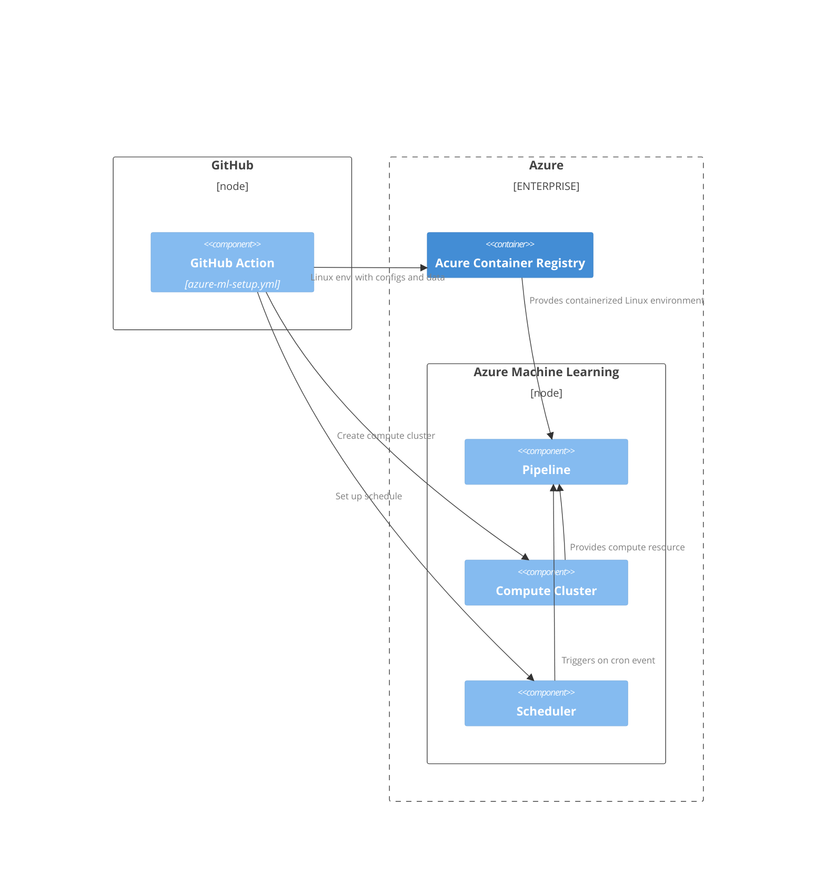
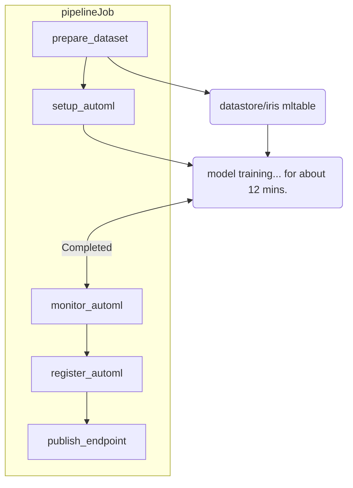

# Azure-ML-automation-research

### `pipelineJob` Definition  

### Tasks of `pipelineJob` in details    

  
Result view of `prepare_dataset` step

  </img>

  
Result view of `setup_automl` step

  </img>

  
Result view of `monitor_automl` step

  </img>

  
Result view of `register_automl` step

  </img>

