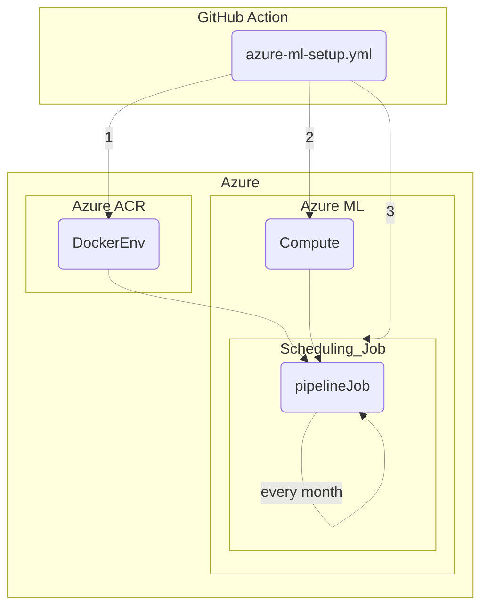
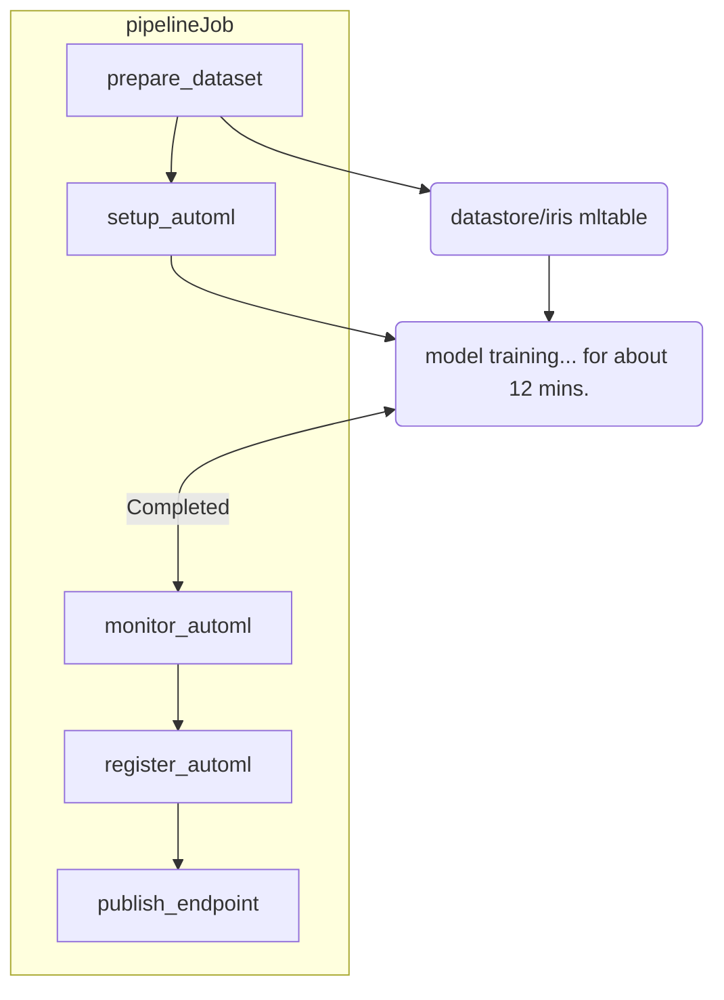

# Azure-ML-automation-research

### `pipelineJob` Definition  

### Tasks of `pipelineJob` in details    

  
Result view of `prepare_dataset` step

  </img>

  
Result view of `setup_automl` step

  </img>

  
Result view of `monitor_automl` step

  </img>

[Register and deploy model ref.](https://learn.microsoft.com/en-us/azure/machine-learning/tutorial-auto-train-image-models?view=azureml-api-2&tabs=cli#register-and-deploy-model)
