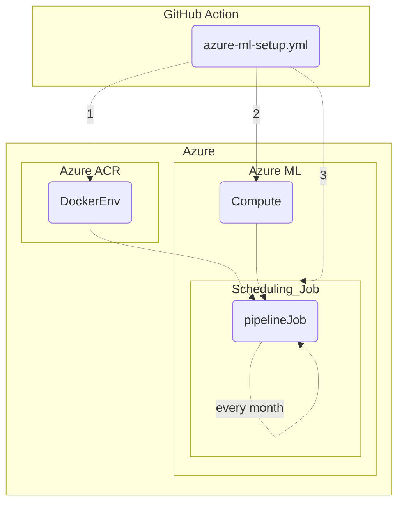
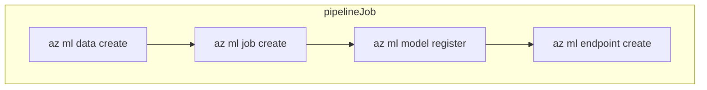

# Azure-ML-automation-research

### `pipelineJob` Definition  

```mermaid
flowchart TD
    subgraph Azure
        
        subgraph Azure ACR
            B(DockerEnv)
        end

        subgraph Azure ML
                C(Compute)
                subgraph Scheduling_Job
                    A(pipelineJob) 
                end 
        end 

    end 

    subgraph GitHub Action
        D(azure-ml-setup.yml)
    end 
    
    D --> |1|B 
    D --> |3|Scheduling_Job
    D --> |2|C
    C --> A
    B --> A
    A --> |every month|A
 
    
    linkStyle 0,1,2,3,4,5 stroke-width:.3px;
```

### Tasks of `pipelineJob` in details    

```mermaid
flowchart TD
    subgraph pipelineJob
        A[az ml data create]
        B[az ml job create]
        C[az ml model register]
        D[az ml endpoint create]
    end 

    A --> B 
    B --> C 
    C --> D
```
