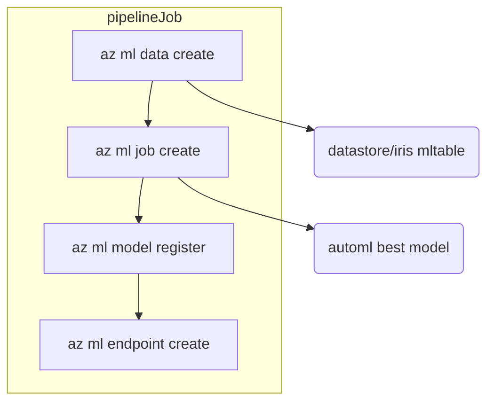

# Azure-ML-automation-research

### `pipelineJob` Definition  

### Tasks of `pipelineJob` in details    

  
Result view of `az ml data create`

  </img>

  
Result view of `az ml data create`

  </img>

